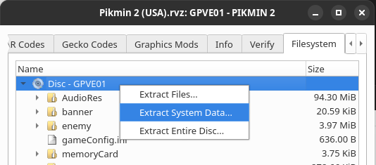

# P2GZ - Pikmin 2 Practice ROM

*A work-in-progress practice tool for Pikmin 2 speedrunning, based on the Pikmin 2 decompilation project.*

NB: you will need to supply your own copy of a Pikmin 2 USA .iso (GPVE01)

Index
-----

- [Dependencies](#dependencies)
  - [Windows](#windows)
  - [macOS](#macos)
  - [Linux](#linux)
- [Building](#building)
- [Modding](#modding)

Dependencies
------------

### Windows

On Windows, it's **highly recommended** to use native tooling. WSL or msys2 are **not** required.  

- Install [Python](https://www.python.org/downloads/) and add it to `%PATH%`.
  - Also available from the [Windows Store](https://apps.microsoft.com/store/detail/python-311/9NRWMJP3717K).
- Download [ninja](https://github.com/ninja-build/ninja/releases) and add it to `%PATH%`.
  - Quick install via pip: `pip install ninja`

### macOS

- Install [ninja](https://github.com/ninja-build/ninja/wiki/Pre-built-Ninja-packages):

  ```sh
  brew install ninja
  ```

- Install [wine-crossover](https://github.com/Gcenx/homebrew-wine):

  ```sh
  brew install --cask --no-quarantine gcenx/wine/wine-crossover
  ```

After OS upgrades, if macOS complains about `Wine Crossover.app` being unverified, you can unquarantine it using:

```sh
sudo xattr -rd com.apple.quarantine '/Applications/Wine Crossover.app'
```

### Linux

- Install [ninja](https://github.com/ninja-build/ninja/wiki/Pre-built-Ninja-packages).
- For non-x86(_64) platforms: Install wine from your package manager.
  - For x86(_64), [wibo](https://github.com/decompals/wibo), a minimal 32-bit Windows binary wrapper, will be automatically downloaded and used.

Building
--------

- Clone the repository:

  ```sh
  git clone https://github.com/p2gz/p2gz.git
  ```

- Using [Dolphin Emulator](https://dolphin-emu.org/), extract your game's system data to `orig/GPVE01`.
  - Right-click the game in Dolphin's game list and select `Properties`.
  - Go to the `Filesystem` tab and right-click `Disc` -> `Extract System Data`.

  - After extraction, the following file should exist: `orig/GPVE01/sys/main.dol`.
- Configure:

  ```sh
  python configure.py --non-matching
  ```

  This:

  - Disables final hash verification.
  - Builds all source files marked as `Matching` and `Equivalent` in `configure.py`.
  - Uses assembly generated from the supplied .iso for any `NonMatching` files.

- Build:

  ```sh
  ninja
  ```

To add new source files to the DOL:

- Uncomment the final `"lib": "moddingU"` bracket in `configure.py` - change the name to whatever you like, and feel free to add more than one new lib using this as a template.
- Add any new files along with their paths as `Object(Matching, folder/file.cpp)` where indicated.
- Within the `link_order_callback` function below the object configuration, uncomment and add each new file with its path within `src`, as indicated.

Once built with `ninja`, the new DOL will exist at `build/GPVE01/main.dol`.
