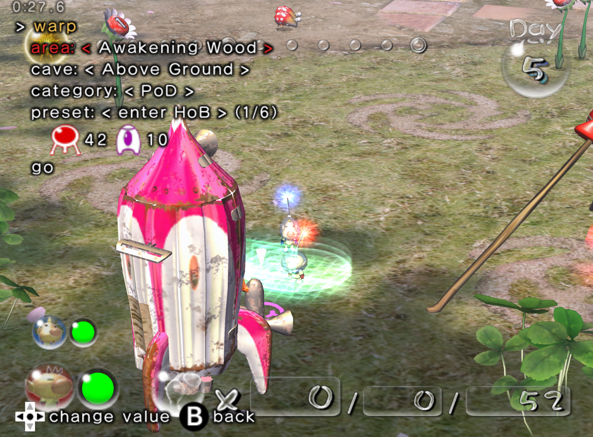
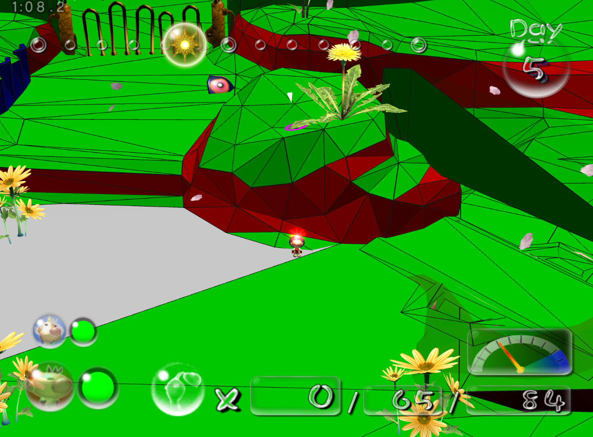
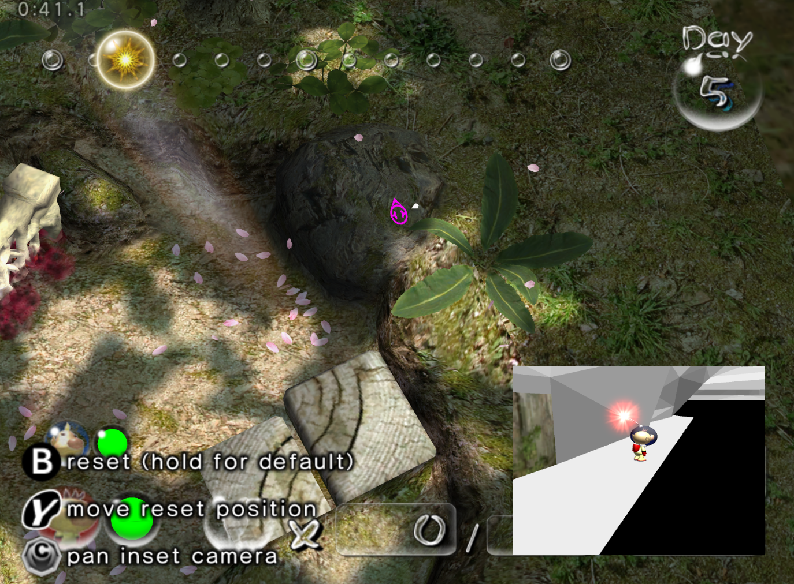
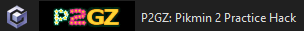
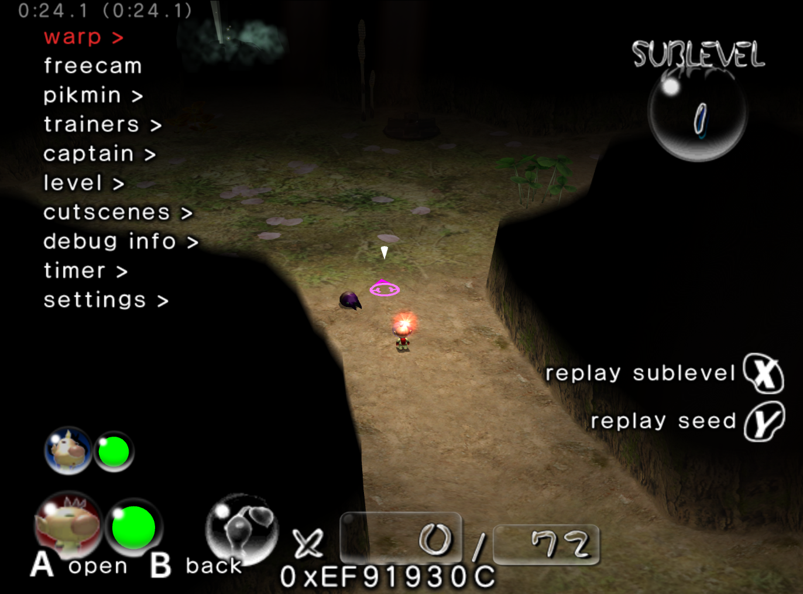
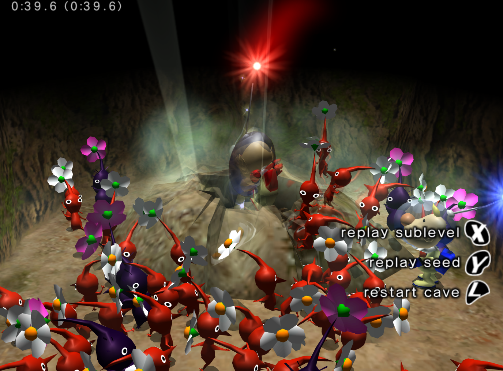
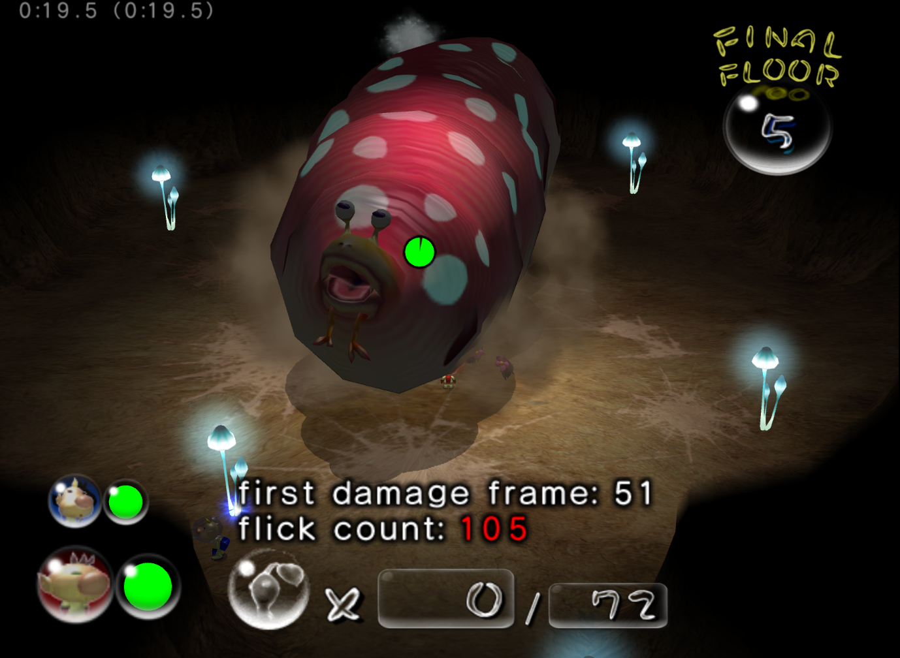
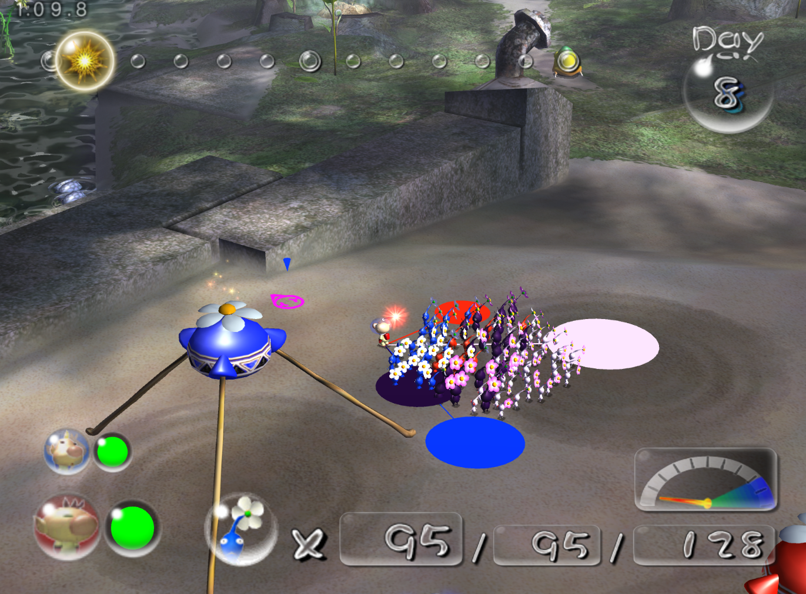
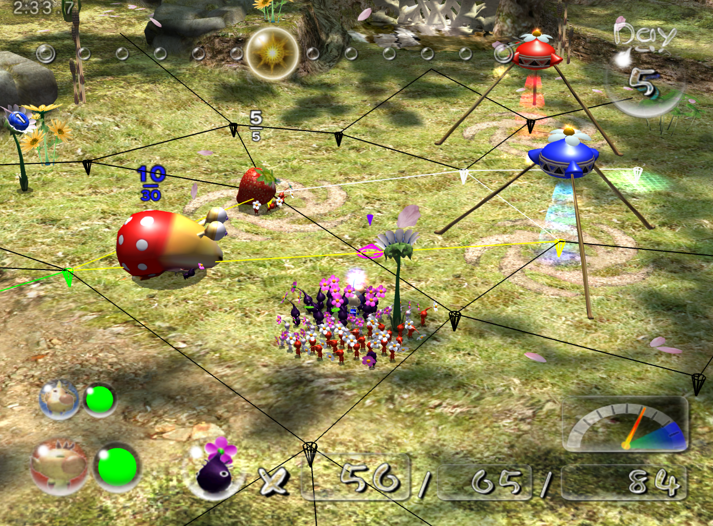

# P2GZ - Pikmin 2 Practice ROM

*A work-in-progress practice tool for Pikmin 2 speedrunning, based on the Pikmin 2 decompilation project.*

> [!IMPORTANT]
> You will need to supply your own legally obtained copy of a Pikmin 2 USA .iso (GPVE01).

**QUICK START: To open or close the GZ menu, double-press D-pad Left from the file select screen, or while in game. To go to a cave or area to practice, use the warp menu and select your desired area and preset.**

<table>
<tr>
<td></td>
<td></td>
<td></td>
</tr>
</table>

If you wish to contribute to the development of P2GZ, please see the contibutor guide [here](CONTRIBUTING.md).

> [!NOTE] 
> If you notice any bugs, unintended features, or crashes while using P2GZ, please submit a bug report using the GitHub Issues tab above to let us know, so we can fix them in a future release. Please include information about what you were doing/what the game state was like when you encountered the problem, how to reproduce it (if known) and screenshots or photos of the very top of the crash log, which will come up automatically on crash, as well as the section below the `-------TRACE` line.

## Getting Started with P2GZ
This provides an overview of how to get P2GZ working, and how to navigate its main features.

### Build P2GZ
To build your own P2GZ ROM, you will need your own legally obtained ISO of Pikmin 2 (GC, USA, GPVE01). Other platforms (Wii, Switch) are not currently supported. Other versions (JP, PAL) are also not currently supported.

Download a .zip file of the [latest release](https://github.com/p2gz/p2gz/releases/latest), and unzip. Follow the instructions in the README.txt included in the zip to build. Building on Windows and Mac OS is supported - Linux is untested.

### Play P2GZ

P2GZ is both Dolphin and console compatible:
- To play on Dolphin, simply open the ISO produced by the build process and enjoy!

- To play on console, please follow a guide on homebrewing (such as WiiBrew) and boot the ISO from USB or SD card using a loading program such as Nintendont. 

**NB: As always, modifying your console is at your own risk - please take care when following homebrew guides.**

### Practice caves and above ground areas
Once you've booted up P2GZ, you can access the P2GZ menu from file select onward, by **double-pressing D-pad-left** on your controller. Some options are only available when opened during gameplay (such as those that depend on a level or assets being loaded), but warping, trainers, and global settings are available from file select.

A couple QoL features are on by default: skippable cutscenes (treasure collection and first-time-entering-area), and skipping save prompts between sublevels. These can be disabled in the P2GZ menu (double-press D-pad-left) under **settings**. These settings will persist when you boot up the game in the future if you are using a memory card (virtual or otherwise). The timer (in the top-left of the screen) will auto-update to account for any skipped cutscenes and for the lack of save prompt.

P2GZ fully supports both Pay Off Debt (PoD) and All Treasures (AT) routes for speedrunning. To practice a segment, open the P2GZ menu (double-press D-pad-left) and select **warp**. Select the area, then the cave (or above ground) you wish to practice using the D-pad. 

A default PoD preset will auto-select - to change, hit A on the preset and choose your category. Presets are then displayed in route order, with a name and preview of your squad/onion setup. Choose your preset, then select **go** to warp. If warping to a cave, you can also enter a set seed to use when generating the layout, if desired. If you want to warp with your current squad, choose "no preset (warp with current squad) instead.

Treasure region (US/JP/PAL) can be changed in the P2GZ menu (double-press D-pad-left) under the **level** submenu, and will take effect when you next warp or load an area. Your selection will be saved to the memory card and will be the default on next boot-up.

When warping with a preset, the game state will be auto-set as if you'd played up to that point yourself, including squad and onion counts, pokos, collected treasures, cutscene flags, upgrades, above-ground structure completions such as gates and bridges, and enemies flagged as killed in all above ground areas. You should be able to continue from your selected preset/area and finish a run (PoD or AT) with no issues.

- Caves provide quick-replay features, either from the hole and geyser screens, or from the P2GZ menu (double-press D-pad-left).
  - To replay the current sublevel with a new seed, hit X.
  - To replay the current sublevel with the SAME seed, hit Y.
  - To replay the current cave from Sublevel 1, hit L.

<table>
<tr>
<td></td>
<td></td>
</tr>
</table>

- Warped-to above-ground areas also allow for quick replay from the P2GZ menu (double-press D-pad-left).
  - To replay the current warped-to segment, press X.

### Trainers
P2GZ supports two quick-reload trainers for key speedrunning tricks: **Fast Empress** and **Early Blues**, which you can access from the **trainers** submenu. We hope these will make learning and de-rusting the speedrun easier.

Trainers will warp you to the appropriate area (HoB5 for Fast Empress, AW for EB) with the appropriate load-out. Each trainer provides info about successes and failures while doing the trick, and will auto-warp you back to the start of the trick on any success or failure.

- The **Fast Empress** trainer provides info about the animation frame you attacked on, and the total flick count when she checks whether she should shake Pikmin off - a successful flick range is marked green, while a failure (either too high or too low) is marked red.

- The **Early Blues** trainer gives the player an additional camera inset, controllable with the C-stick, to show the out-of-bounds collision. Successes and failures are noted with what went wrong, and also whether an attempt would've soft-locked without EB patch. On hitting the void or warping to the Blue Onion area, the player is re-warped back to inside the scales to reattempt. You can also adjust your reset position with Y (to set) and (holding) B (to reset), if you wish to just practice part of the trick.

### Freely adjust your squad

Pikmin counts can be adjusted while practising using the **pikmin** submenu, including current squad and onion counts. Onions can also be unlocked or re-locked using the same menu. 

To practice a segment with a customised squad:
1. Warp to the segment with a close-enough preset (to set all the other flags).
2. Adjust your squad using the **pikmin** submenu.
3. Warp back to the segment using the warp menu, but select "no preset (use current squad)" from the **preset** submenu. 

If done on Sublevel 1 in a cave, your customised squad will be maintained when using the quick cave replay option.

### Freely move around the map

There is also **freecam mode**, which allows you to teleport your captain (and current squad) with you around the map to any (standable) location. This can be used in caves to quickly see a layout without having to walk around manually, or to quickly get to a hole/geyser. To travel faster while in freecam mode, hold the **L** trigger.

### Learn about how Pikmin 2 works
The display of various debug text is supported during gameplay, available through the P2GZ menu (double-press D-pad-left) under the **debug info** submenu, including:
- Circles that will predict the dismiss positions of your current Pikmin squad.

- Enemy info, including current state, flick count, position, and collision spheres.
- Captain info, including current positions, speeds, angles, and swap times.
- Treasure info, including name, ID, carry power and speed.
- Collision viewer, to toggle on debug triangles for map collision, including slip factors.

- Waypoint viewer, showing the waypoint graph, including highlighting the waypoints used when determining a treasure's path.

- Spawn point viewer in caves, showing the spawn locations and types on the various cave tiles.
- Structure info, including gate, bridge and plug health.

Various aspects of the game are also fully controllable, including:
- Treasure locations and regions through the **level** submenu.
- Structure states (gate, bridge, bag and plug statuses/healths) and time of day also through the **level** submenu.
- Cutscene flags for every triggerable cutscene in the game, through the **cutscenes** submenu.
- Spray counts, currently obtained upgrades, current pokos, captain health, and moonjump (boing mode) through the **captain** submenu.

